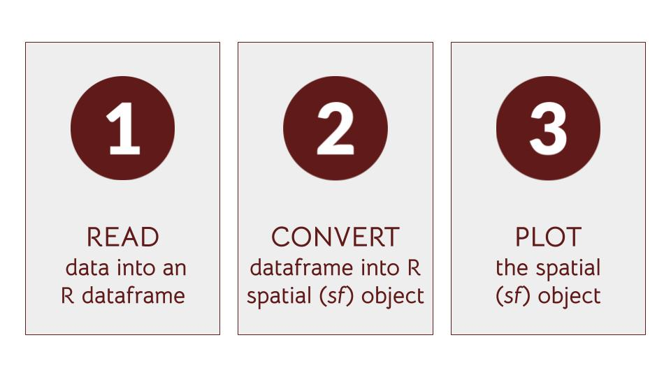

```{r setup, include=FALSE}
knitr::opts_chunk$set(echo = TRUE)
```


## A. Outline of this tutorial practical session

This session is a practical in which we challenge you to make a map from data that you have brought with you or found online. The aim is to start your journey away from the safety of the prepared data we have provided in earlier sessions. Mapping real-world data can involve tricky steps to do with data cleaning, reading or manipulating. We aim to provide you with some support in this session to start addressing any such trickiness you may encounter. It is also challenging for us as instructors to move away from the safety of the prepared datasets we know. We cannot anticipate all issues or guarantee that we will be able to fix them in this session. However, we can give you a helping hand to getting started and show you how we approach solving such issues ourselves.

**We challenge you to make a map in which data are represented by differences in colour and/or symbol size to communicate something about their spatial pattern.**

e.g. it might show that values are higher in one area or that there is no particular pattern.


### Learning outcomes

By the end of this session, you will have experienced making a map from data of your own choice. This could be data that you have brought with you, found online or that we have provided. Specifically, you will be able to:

* make decisions on how to manipulate some data of your choice to make a map 
* read your own data into R for further manipulation and mapping
* have ideas on how to troubleshoot inevitable tricky issues with mapping 
* start to think about presenting data on a map to communicate a message (e.g. classifications and colour palettes)
* have some ideas for where to look for open data


### Practical options

Our suggestion for you to do in this session (in order of preference) is to make a map from:

1. Coordinate data that you have brought with you
2. Coordinate data that you have found online
3. Data we have provided
4. Data referenced by place names (Note that this requires knowledge of packages we didn't cover today. Please see pointers in section H below.)

By the end of the session, we would like you to email a screenshot of your mapping efforts (or save it into your RStudio Cloud project) - it doesn't matter how far you get. We will compile these into a document to send out to all participants afterwards.


### Questions to ask before starting with your map

1. What do you want to map?
2. What format is the data in (e.g. .csv, .xls, .shp, other)?
3. For .csv or .txt, what are the names of the columns that contain the latitude and longitude coordinates?
4. If you want to compare data from different places, what will you use to visualise the differences (e.g. point size, colour, etc)?
5. Do you want to add other data types to your map to give more context (e.g. add layers (different data objects))?
6. Which mapping package do you want to start with? We covered `tmap` and `mapview` in this tutorial (there are also others)


### Troubleshooting recommendations (Google is your friend) 

Errors, and failures to achieve what we expected or wanted, are inevitable when coding with real data. They happen regularly to all programmers and data analysts, even experienced ones. We cannot teach you how to avoid such errors and temporary failures but we can pass on how we deal with them when they happen to us. A useful thing to consider is that if you come up against a problem, the likelihood is that someone else in the world will have come up against it before. The beauty of coding, the internet and particularly R, is that someone is likely to have posted a solution to your problem somewhere. All you need to do is find it.

To find solutions, we recommend that Google - or your search engine of choice - is the best first step.

1. If you get an error message: copy part of that message into the Google search box

2. If you want to do something and you are not sure how: type your question into the Google search box


When you are looking for answers to your questions or solutions to your problems online, your challenge will be to filter a useful answer that helps you solve your problem, from probably lots of other results that are either not quite relevant, or are outdated, or you don't understand. All of these happen to us.

One recommendation is to **focus on recent answers - ideally less than a year old**. Open-source software is changing all of the time, so solutions more than a year old may no longer work or be the best way.


## B. Data

We suggest that you use one of these sources of data (in order of preference):

1. Coordinate data brought by you   (refer to [Section D](#d.-map-your-own-coordinate-data))
2. Coordinate data found online     (refer to the section on [Online sources of data](#online-sources-of-data) and [Section E](#e.-coordinate-data-found-online))
3. Data we have provided            (refer to [Section F](#f.-data-we-have-provided))
4. Data referenced by place names   (refer to [Section H](#h.-data-referenced-by-place-names))


### Online sources of data

If you have not brought any data with you, here are a few suggested sources of data that can be mapped in R.

We suggest that you don't spend too long in the practical looking for the perfect data, but instead find something that looks interesting to you and then spend more time on trying to make a map with it.

#### Humanitarian Data Exchange (HDX) [https://data.humdata.org/](https://data.humdata.org/)
A useful website with a searchable database of datasets for humanitarian action. You can search by typing in a country name and optionally select a `Geodata` checkbox to refine a search.

#### rspatialdata [https://rspatialdata.github.io/](https://rspatialdata.github.io/)
A nice website offering tutorials and pointers to online spatial data that can be mapped in R. Some of these tutorials are a little more advanced than those we have introduced here.


## C. Uploading data to RStudio Cloud

To use your own data for mapping in RStudio Cloud, you will first need to upload the data from your local computer to the cloud by clicking on `Upload` in the Files pane (typically the bottom right pane). We suggest you create a `data` folder in the directory where you are running the R script (for this tutorial it is `for_learners/data`) and save the data that you're uploading to this newly created `data` folder. 


## D. Map your own coordinate data

### Suggested steps

Remember, to map these data in R usually requires a 3 step process:

1. read the data file into R (hint: `readr` package; `read_csv`)
2. convert the dataframe into an R spatial (package `sf`) object and set `crs` (hint: `sf::st_as_sf`)
3. plot the `sf` object (create a quick interactive plot using `mapview`)



## E. Coordinate data found online

We suggest that you don't spend too long in the practical looking for the perfect data, but instead find something that looks interesting to you and then spend more time on trying to make a map with it.

Download this data to your computer, and then follow the steps for uploading this into RStudio Cloud. Then try to map using the suggested steps:

### Suggested steps

Remember, to map these data in R usually requires a 3 step process:

1. read the data file into R (hint: `readr` package; `read_csv`)
2. convert the dataframe into an R spatial (package `sf`) object and set `crs` (hint: `sf::st_as_sf`)
3. plot the `sf` object (create a quick interactive plot using `mapview`)


## F. Data we have provided

If you do not have your own data or did not find any, we have provided an example dataset in the `for_learners/data` folder in the RStudio Cloud project called `health_demo.csv` (a subset of the dataset: [World Health Organization (WHO) (2019) A spatial database of health facilities managed by the public health sector in sub-Saharan Africa](https://www.who.int/malaria/areas/surveillance/public-sector-health-facilities-ss-africa/en/)).

### Suggested steps

Remember, to map these data in R usually requires a 3 step process:

1. read the data file into R (hint: `readr` package; `read_csv`)
2. convert the dataframe into an R spatial (package `sf`) object and set `crs` (hint: `sf::st_as_sf`)
3. plot the `sf` object (create a quick interactive plot using `mapview`)


## G. Extra steps

If you have time in this tutorial, try your hand at these extra steps. Or try them after the tutorial. Please reach out to the trainers to address any difficulties you come across.

1. Practice exploring what the object contains (hint: e.g. `head`, `str`, `names`, `class`)
2. Play with the arguments in `mapview` (e.g. `zcol`, `label`, `cex`)
3. What happens when you exclude the `crs` argument in `mapview`?
4. Try creating an interactive plot using `tmap` that is similar to a `mapview` one (hint: `tmap_mode("plot")` for a static map; `tmap_mode("view")` for the interactive viewing mode)
5. Add layers from the objects in `afrilearndata` to your own map data e.g. `africapitals` `afriadmin` `africontinent`


## H. Data referenced by place names

If your data only has names of regions or places and no coordinates, you will need to join these names to spatial data that does have the coordinates. To learn how to join spatial and non-spatial data based on place names, you can work through the afrimapr online tutorial on [joining](https://andysouth.shinyapps.io/join-admin/#section-outline-of-this-tutorial); also available via [afrilearnr](https://github.com/afrimapr/afrilearnr/tree/main/inst/tutorials/join-admin).

We provide a concise example here:


```{r join-example, message=FALSE, warning=FALSE}

library(mapview)
library(sf)
library(dplyr)
library(afrilearndata)

# 1. example dataframe
mydf <- data.frame(country=c("Togo","Ghana"),
                   language=c("French","English"))

# 2. join the dataframe onto an existing spatial object
africa_df <- dplyr::left_join(x = africountries, 
                              y = mydf, 
                              by = c("name_long" = "country")
                              )
# 3. visualise the joined data
mapview(africa_df, zcol="language")

```

**Note that interactive maps will not show up in a static PDF document if you run the `knit` command.**


