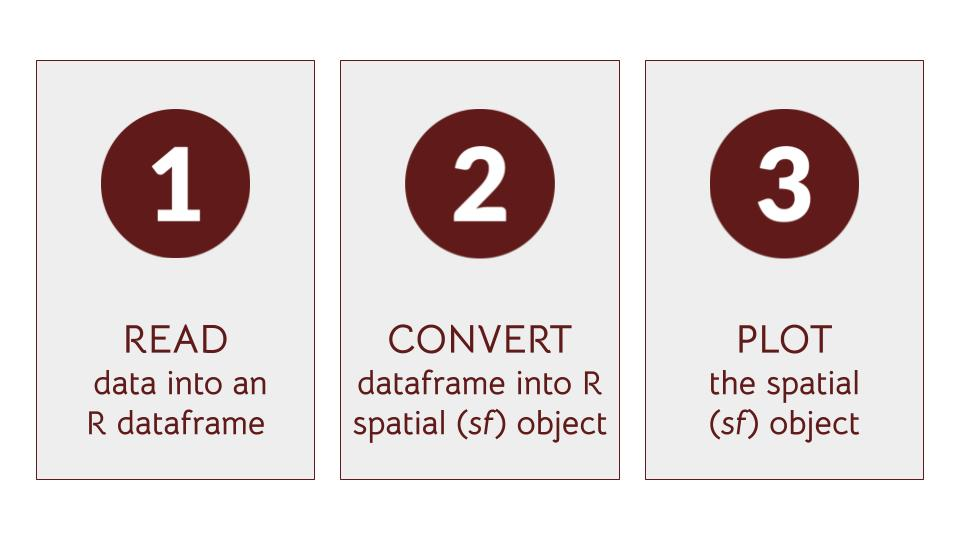

```{r setup, include=FALSE, warning=FALSE, message=FALSE}
knitr::opts_chunk$set(echo = TRUE)
```

```{r mapview knit error, echo = FALSE}

# there is a problem with mapview knitting in r markdown. See the error report here:
# https://github.com/r-spatial/mapview/issues/312
# Running the suggested code `remotes::install_github("r-spatial/mapview")` made the knit work here.
#remotes::install_github("r-spatial/mapview")

```

Ceci est la 2ème session du tutoriel développé pour useR! 2021 sur la cartographie dans R avec des données sur le continent africain. La cible de ce tutoriel est une audience avec une expérience de R et de GIS limitée.

Le tutoriel est basé sur le package [afrilearnr](https://github.com/afrimapr/afrilearnr) qui contient des [tutoriels](https://github.com/afrimapr/afrilearnr/tree/main/inst/tutorials) ayant pour objectif d'enseigner des compétences de manipulation de données spatiales avec des données africaines. Il fait partie du projet [afrimapr](https://afrimapr.github.io/afrimapr.website/) qui est financé par _Wellcome Trust’s Open Research Fund and Data for Science and Health_.

Ce tutoriel a été adapté en fonction des besoins de useR! 2021. Pour plus d'informations et de leçons, veuillez consulter les [tutoriels en ligne](https://afrimapr.github.io/afrimapr.website/training/).

Des fichiers PDF des tutoriels ont été inclus dans le dossier du projet.


## A. Les grandes lignes de la session

Ceci est une introduction au processus d'importation des données spatiales de différents types dans R. L'objectif est de vous aider à importer vos propres données dans R afin de faire des cartes et autres visualisations. Les participants ayant une expérience limitée en R et GIS sont notre cible.


### Résultats d'apprentissage

À la fin de ce tutoriel, vous aurez appris comment importer différents types de données spatiales dans R afin de les utiliser pour créer des cartes statiques et intéractives. De façon plus spécifique, vous serez à mesure de:

* importer des données spatiales avec les packages `sf` et `raster`
* créer des cartes à partir de données tabulaires contenant des coordonnées
* comprendre l'importance du système de référence des coordonnées (CRS - Coordinate Reference System) pour placer des données sur la carte du monde
* Importer d'autres types de fichiers contenant des données spatiales vectorielles et maillées (raster)
* créer des cartes statiques et intéractives avec le package `mapview` en utilisant les données du package `afrilearndata`
* comprendre les options permettant de rendre les cartes `mapview` plus utiles

N'hésitez pas à contacter les formateurs et les autres participants durant et/ou après le tutoriel pour leur faire savoir vos difficultés éventuelles. 


## B. Charger les packages et les données

Pour les besoins de ce tutoriel useR! 2021, les packages ont déjà été installés dans le projet RStudio Cloud. Vous n'aurez donc qu'à exécuter les codes ci-dessous afin de les charger (ouvrir) dans l'environnement de la session courante. Cependant, si vous travaillez sur ce tutoriel à partir d'une installation locale de R/RStudio sur votre machine, alors vous aurez tout d'abord à installer les packages si vous ne l'avez pas déjà fait. Un script qui installera tous les packages requis est disponible dans le dossier principal du projet sous le nom de: `packages_and_data.R`.

```{r packages, warning=FALSE, message=FALSE}

# pour manipuler les données vectorielles
library(sf) 

# pour manipuler les données maillées (raster)
library(raster) 

# exemples de données spatiales sur le continent africain
library(afrilearndata)

# pour la cartographie statique et intéractive
library(tmap)

# pour la cartographie intéractive
library(mapview)

# pour importer des fichiers textuels
library(readr)            

```


## C. Importer des données spatiales et créer un aperçu avec `mapview`

Les données que nous avons utilisées jusqu'ici existaient déjà dans R en tant qu'objets.

Nous pouvons faire les même choses en utilisant des données qui résident dans des fichiers.

Les données spatiales peuvent être importées avec la fonction `sf:st_read()` pour les données vectorielles (points, lignes et polygones) et le package `raster` pour les données maillées (raster).

Nous vous présentons des exemples en utilisant des fichiers qui sont stockés dans le package. Si vous voulez utiliser vos propres données:

* Sautez l'étape 1 de création du nom du fichier (vous devez connaître le nom de votre fichier et savoir où il est enregistré sur votre ordinateur)
* Remplacez filename1 ou filename2 par le chemin de votre fichier de données vectorielles ou maillées (raster) sur votre ordinateur

```{r read-files-vector}

library(sf)
filename1 <- system.file("extdata","africountries.shp", package="afrilearndata", mustWork=TRUE)
myobject1 <- sf::st_read(filename1)

```

```{r read-files-raster}

library(raster)
filename2 <- system.file("extdata","afripop2020.tif", package="afrilearndata", mustWork=TRUE)
myobject2 <- raster::raster(filename2)

```

Rappelez vous que pour que ces commandent fonctionnent, vos données doivent être dans un format vectoriel (ex. shapefile, geopackage ou kml) ou dans un format maillé (raster) (ex. .tif ou .grd). Pour plus d'informations sur les formats compatibles, consultez la page <https://en.wikipedia.org/wiki/GIS_file_formats>.

Plus tôt, nous avons démontré comment utiliser le package `tmap`. Dans cette session, nous vous présenterons le package `mapview` pour rapidement créer des cartes intéractives. Les cartes créées par `mapview` sont similaires à celles produites par `tmap` sur plusieurs points. Nous aimons utiliser `mapview` parce qu'il permet d'obtenir un aperçu cartographique de ses données spatiales très facilement. Tout ce dont vous avez besoin c'est le code `mapview([nom_objet_spatial])` et vous obtenez une carte. Contrairement à `tmap`, vous n'avez pas besoin de savoir si l'objet contient des points, des lignes, des polygones ou des données maillées (raster) et vous n'avez pas besoin de vous rappeler des options additionnelles pour effectuer une première carte.

**Il est à noter que les cartes intéractives n'apparaitront pas dans des fichiers PDF créés avec `knit`.**


```{r mapview1, warning=FALSE, message=FALSE}

library(mapview)
mapview(myobject1)

```

```{r mapview2, warning=FALSE, message=FALSE}

mapview(myobject2)

```

Nous verrons plus tard que `mapview` a des arguments pour vous donner plus de contrôle sur l'apparence générale de votre carte.


## D. Les fichiers .csv, .txt ou .xls avec des coordonnées

Jusqu'ici nous avons utilisé des fichiers et des objets qui étaient déjà stockés en tant qu'objets spatiaux. Ils provenaient d'un package analyse spatiale dans R. À présent, nous allons travailler avec des données qui ne sont pas encore dans un format spatial. Ceci pourrait être une feuille de calcul ou encore un fichier de texte avec une composante spatiale que vous avez créé vous-même.

Les fichiers textuels qui contiennent des données ponctuelles font partis des types de fichiers les plus communs que nous retrouvons dans les opérations cartographiques à petite échelle. Généralement, ces types de fichiers sont structurés comme suit: chaque ligne représente une entité spécifique (par ex. la position d'un centre de santé ou un cas de maladie ou une habitation), deux colonnes qui contiennent les coordonnées de la position (longitude et latitude, ou x et y), ainsi que d'autres colonnes contenant des attributs du lieu (par ex. type de lieu ou de maladie).


attribut1 | longitude | latitude
----------| --------- | ------------------
entite1   | -10       | 20
entite2   | 10        | 0  
...       |           |

Ces fichiers peuvent être de format `.csv` (délimités par des virgules), `.txt` (délimités par des tabulations) ou encore des feuilles de calculs comme les fichiers d'extension `.xls`.

Pour cartographier ces données en R, 3 étapes sont requises:



Ici, nous allons démontrer les 3 étapes en utilisant des données sur des aéroports provenant de l'excellente table des données [ourairports](https://ourairports.com/continents/AF/airports.csv) que nous avons extraites et inclues dans le package [afrilearndata](https://github.com/afrimapr/afrilearndata).


```{r csv-airports1}

# Étape 1. Importer les données dans un dataframe dans R

filename <- system.file("extdata", "afriairports.csv", package="afrilearndata", mustWork=TRUE)
mydf <- readr::read_csv(filename)

mydf <- mydf[(1:100), ] # Sélectionner les 100 premières lignes afin d'accélerer l'analyse
```


```{r csv-airports2}

# Étape 2. Convertir les données en objet sf et spécifier le SCR (système des coordonnées de référence) (CRS en anglais)

mysf <- sf::st_as_sf(mydf, 
                     coords=c("longitude_deg", "latitude_deg"),
                     crs=4326)
```


```{r csv-airports3}

# Étape 3. Carte intéractive rapide

# Ici nous utilisons `mapview` - un autre package alternatif à `tmap` pour la création de cartes (il est à noter que `tmap` peut faire des cartes statiques tandis que `mapview` ne peut pas)

mapview(mysf)    

```


**Si vous voulez appliquer le code ci-dessus à vos propres données:**

Les étapes qui suivent sont applicables si vos données sont sous forme tabulaire avec deux colonnes de coordonnées (longitude et latidue) pour chaque point (ligne).

* dans la variable `filename`, enregistrez le chemin de ton fichier (qui est similaire à `"mes_donnees/mon_fichier.csv"`)
* remplacez `"longitude_deg"` et `"latitude_deg"` avec les noms des colonnes qui contiennent la longitude et la latitude dans vos propres données
* vous aurez peut-être à spécifier `crs=4326` comme expliqué plus bas

(Dans RStudio Cloud, vous aurez à mettre vos données en ligne tout d'abord, nous en parlerons dans la session 3)


### SCR (système des coordonnées de référence) (CRS en anglais)

`scr` veut dire Système de Coordonnées de Référence (Coordinate Reference System en anglais). Il détermine comment les coordonnées sont transformées pour représenter un lieu sur la terre. Dans notre cas, il précise à `sf` quel système à utiliser. Dans la plupart des cas, les coordonnées (collectés d'un GPS) sont stockées dans un système représenté par le code `4326`. `4326` est le code EPSG (European Petroleun Survey Group) pour la longitude et la latitude utilisant le point de référence WGS84, mais nous n'avez pas vraiment besoin de savour tout ça. Rappelez-vous juste du nombre `4326`! Si vous voulez en savoir plus, veuillez visiter la page <https://epsg.io/about>.

**Regardez le résultat** lorsque l'argument `crs=4326` n'est pas inclut dans l'étape 2 ci-dessous:


```{r csv-crs-missing}

# Étape 1. Importer les données dans un dataframe dans R

filename <- system.file("extdata", "afriairports.csv", package="afrilearndata", mustWork=TRUE)
mydf <- readr::read_csv(filename)

mydf <- mydf[(1:100), ] # Sélectionner les 100 premières lignes afin d'accélerer l'analyse


# Étape 2. Convertir les données en objet sf (remarquez que le SCR n'est pas spécifié)

mysf <- sf::st_as_sf(mydf, 
                     coords=c("longitude_deg", "latitude_deg"))


# Étape 3. Carte intéractive rapide

mapview(mysf)    

```

Lorsque l'argument `crs` n'est pas spécifié, l'objet `sf` est bel et bien créé cependant `mapview` n'est pas à mésure de le positionner sur la carte du monde. Les points apparaissent bel et bien, cependant la carte de fond n'apparait pas.


### Les fichiers .xls

Pour les fichiers Microsoft Excel, vous aurez juste besoin de changer le code dans l'étape 1 ci-dessus. Les autres étapes resteront les mêmees: importer, convertir, créer une carte.

Vous pouvez importer un fichier Excel dans un dataframe avec le package [readxl](https://readxl.tidyverse.org/) avec un code comme `readxl::read_excel("[nom_du_ficher]")`. Une autre option est de sauvegarder la feuille de calcul Excel en tant que `.csv` à partir d'Excel même et exécuter les étapes expliquées pour les fichiers `.csv`.


## E. Créer un objet R directement

En lieu et place d'importer un fichier, il est aussi possible de créer un dataframe avec des coordonnées directement dans R. Lorsque vous créez un dataframe dans R, vous n'aurez pas besoin d'importer un fichier car les données sont créées dans R même.

Dans l'exemple ci-dessous, essayez de changer les coordonnées dans le dataframe dans l'étape 1, et regardez comment les points changent.

```{r dataframe-sf}

# Étape 1. Créer un dataframe

mydf <- data.frame(x=c(-10,10,30),
                   y=c(20,0,-20),
                   attribute=c("a","b","c"))

# Étape 2. Convertir les données en objet sf

mysf <- sf::st_as_sf(mydf, 
                     coords=c("x", "y"),
                     crs=4326)

# Étape 3. Carte intéractive rapide

mapview(mysf)    

```

Il est à noter que, dans cette exemple, les coordonnées sont stockées dans des colonnes nommées `x` et `y` qui sont communiquées à `sf::st_as_sf` dans l'argument `coords=c("x", "y")`. Si vous voulez obtenir plus d'informations sur une fonction, vous pouvez taper `?` avant le nom de la fonction (par ex. `?st_as_sf`).


## F. Les shapefiles (.shp)

Les shapefiles démeurent le format le plus commun pour les données spatiales malgré qu'ils sont vieux et que certains de leurs attributs ne soient pas idéaux. Une chose qui peut confondre les utilisateurs est que les shapefiles sont un ensemble de fichiers de même nom mais dont les suffixes sont différents. Si certains fichiers dans l'ensemble ne sont pas disponibles, alors il se peut qu'il ne soit plus possible d'utiliser les données.

Par ex. myfile.shp, myfile.shx, myfile.dbf, myfile.prj

Si vous n'avez qu'un seul fichier avec le suffixe `.shp`, vous ne pourrez pas l'utiliser pour créer des cartes en R. Vous aurez plutôt besoin de tous les autres fichiers.

Les shapefiles peuvent stocker des points, des lignes et des polygones. Dans l'exemple qui suit, nous utilisons un shapefile contenant des polygones.


```{r shp-countries}

# Importer le fichier dans un objet spatial
filename <- system.file("extdata","africountries.shp", package="afrilearndata", mustWork=TRUE)
africountries <- sf::read_sf(filename)

# Carte intéractive rapide
mapview(africountries)

```
  
Les shapefiles sont des fichiers spatiaux, donc ils peuvent être importés directement dans un objet spatial `sf` avec `sf::read_sf(nom_du_fichier)`. Ceci combine les étapes 1 et 2 de l'exemple avec le fichier `.csv`. En plus de celà, vous n'avez pas besoin de spécifier quelles colonnes qui contiennent les coordonnées ou quel est le Système de Référence des Coordonnées (SRC). La raison est que ces deux étapes sont effectuées au moment de la création du fichier. En d'autres termes, ces fichiers spatiaux communiquent directement à R quelles sont les coordonnées et le SRC sans que nous ayons à le faire.


## G. Les fichiers .kml, .gpkg and .json

Pour d'autres formats de fichiers spatiaux (par ex. kml, geopackage et geojson), la même approche utilisée pour les shapefiles fonctionne aussi (`sf::read_sf(nom_du_fichier`).

Ici, nous voyons un exemple avec la version .kml du réseau d'autoroutes africaines du package `afrilearndata` utilisé  plus haut.

```{r kml-highways, warning=FALSE, message=FALSE}

filename <- system.file("extdata","trans-african-highway.kml", package="afrilearndata", mustWork=TRUE)

afrihighway <- sf::read_sf(filename)

# Carte intéractive rapide
 mapviewOptions(fgb = FALSE) # pour corriger une erreur fréquente
mapview(afrihighway)

```


## H. Les fichiers maillés (raster): tiff 

Le package `raster` peut être utilisé pour importer les données maillées (raster) au lieu de `sf`.

(Il est à noter qu'il existe des packages plus récents tels que `stars` et `terra` qui pourraient remplacer `raster` dans le futur, mais nous avons décidé d'utiliser `raster` pour ce tutoriel puisqu'il est plus connu et plus mature. Nous vous encourageons à tester les autres packages dès que vous aurez un peu plus d'expériences dans la cartographie en R).

La fonction du package `raster` qui permette d'importer les données est aussi nommée `raster`. Pour importer un fichier, utilisez: `myrast <- raster::raster(nom_du_fichier)` ou juste `myrast <- raster(nom_du_fichier)`. Tout comme les données vectorielles, vous pouvez aussi utiliser `mapview` afin d'avoir un aperçu rapide des objets raster avec `mapview(myrast)`.

Le code `raster(nom_du_fichier)` marchera aussi avec d'autres formats de données maillées tels que les mailles ascii ou jpg.


```{r rast1, message=FALSE, warning=FALSE}

filename <- system.file("extdata","afripop2020.tif", package="afrilearndata", mustWork=TRUE)

myrast <- raster::raster(filename)

# Carte intéractive rapide
mapview(myrast)
```

La carte qui vient d'être créée est essentiellement sombre. Ceci est dû au problème auquel nous avons fait face dans la première session. Il n'y a seulement que quelques cellules à haute densité tandis que la majorité des cellules représentent de petites valeurs. Ce problème est très récurrent lorsqu'on travaille avec les données sur les populations. Par défaut, les intervalles de classification sont de taille égale par défaut, ce qui n'est pas judicieux dans ce cas puisque presque toutes les cellules de la carte appartiennent aux catégories de valeurs faibles. Cependant, avec quelques efforts, vous pourrez vous apercevoir qu'il y a quelques valeurs élevées sur la carte (par ex. à Lagos et au Caire). 

Dans la première session de ce tutoriel, nous avons réglé le problème avec `tmap` en utilisant l'argument `breaks=` afin de spécifier des intervalles pour les couleurs. Dans `mapview` nous pouvons faire la même chose en utilisant l'argument `at=`.

Essayez le code suivant `mapview(myrast, at=c(0,1,10,100,1000,10000,100000))`. Changez ensuite les intervalles à votre guise.


## I. Les options de `mapview`

Dans les exemples de `mapview` que nous avons vus, nous l'avons utilisé afin d'obtenir un aperçu rapide de nos objets spatiaux sans ajouter d'options spécifiques. `mapview` est très souple et peut communiquer beaucoup plus d'informations juste en y ajoutant quelques arguments additionnels. Copiez le code qui suit et remplacez la dernière ligne du bloc de code qui suit avant de l'exécuter. Il utilise les colonnes nommées `type` et `name` du fichier de données afin d'appliquer un label sur chaque point. L'argument `cex` spécifie la taille des points (dans ce cas, nous les rendons plus petits).

`mapview(mysf, zcol='type', label='name', cex=2)`


```{r mapview-options-airports}

# 1. Importer les données dans un dataframe
filename <- system.file("extdata", "afriairports.csv", package="afrilearndata", mustWork=TRUE)
mydf <- readr::read_csv(filename)

mydf <- mydf[(1:100), ] # Sélectionner les 100 premières lignes afin d'accélerer les opérations en ligne

# Ou vous pouvez sélectionner un pays
#mydf <- mydf[which(mydf$country_name == "Cameroon"), ]

# 2. Convertir les données spatiales en objet sf
mysf <- sf::st_as_sf(mydf, 
                     coords=c("longitude_deg", "latitude_deg"),
                     crs=4326)

# 3. Carte intéractive rapide
mapview(mysf)
#mapview(mysf, zcol='type', label='name', cex=2) 


```

Pour plus d'informations ssur les options de `mapview`, tapez `?mapview` dans votre console et pressez "Entrée". Ceci devrait affichier la page d'aide de la fonction `mapview` sous l'onglet `Help` dans le coin bas-gauche de votre écran RStudio. Faîtes défiler vers le bas jusqu'à ce que vous voyiez **Arguments** en gras où se trouvent plus d'informations sur les paramètres. Il est à noter que toutes ces options ne marchent pas nécessairement avec les fichiers vectoriels.

Les arguments suivant sont les arguments de `mapview` les plus utilises:

argument  | valeur | quel est le rôle de cet argument ?
--------- | ----- | -------------------------------------
zcol      | nom d'une colonne | détermine les couleurs attribuées aux entités et crée la légende
label     | nom d'une colonne ou du texte  | donne un label qui s'affiche sous placement du curseur
cex       | nombre (ex. 2) ou nom d'une colonne | spécifie une taille pour les points qui est constante ou dépend des valeurs d'une colonne 
col.regions | `'blue'` | une couleur individuelle ou une palette de couleurs pour l'intérieur des cercles
color | `'red'` | une couleur individuelle ou une palette de couleurs pour le bord des cercles
alpha.regions   | un nombre entre 0 et 1 | opacité de l'intérieur des cercles, 0=invisible 
alpha   | un nombre entre 0 et 1 | opacité du bord des cercles, 0=invisible, qui retire le bord des cercles
legend | `TRUE` ou `FALSE` | ajoute une légende, TRUE par défaut
map.types | `c('CartoDB.Positron', 'OpenStreetMap.HOT')` | carte de fond
at | une série de valeurs numériques, par ex. `c(0,1,10)` | les extrémités des intervalles


## Les prochaines étapes

Ceci n'est qu'un début. Il y a plusieurs autres options pour faire des cartes avec R. Plus des informations plus détaillées ainsi que des leçons, veuillez consulter les [tutoriels en ligne](https://afrimapr.github.io/afrimapr.website/training/) et le package [afrilearnr](https://github.com/afrimapr/afrilearnr) qui contient ces [tutoriels](https://github.com/afrimapr/afrilearnr/tree/main/inst/tutorials) sur Github.

Plus d'informations concernant l'importantion de différents fichiers spatiaux dans R peuvent être trouvées dans cette section de l'excellent: [Geocomputation in R](https://geocompr.robinlovelace.net/read-write.html#data-input).


## En résumé

Nous espérions que vous avez aimé cette brève introduction sur comment importer ses propres données spatiales dans R.

Nous vous avons montré:
1. Comment importer des données à partir de fichiers avec `sf` et `raster`
2. Comment faire une carte en utilisant les coordonnées d'un fichier de texte
3. l'importance du SRC (Système de Référence des Coordonnées) pour placer des données sur la carte du monde
4. Comment importer d'autres types de fichers contenant des données spatiales vectorielles ou maillées (raster)
5. Des options pour améliorer les cartes produites par `mapview`


## useR! 2021: la prochaine session

La session suivante sera une session pratique au cours de laquelle vous pourrez utiliser vos propres données pour faire de la cartographie. Vous aurez besoin de coordonnées afin de pratiquer ce que vous avez appris aujourd'hui. Il est fort probable que vos données soient d'un format différent. Par exemple, il se peut que vos données n'aient que des noms de régions sans coordonnées. Si c'est le cas, vous aurez besoin de fusionner ces noms à des données spatiales qui contiennent les coordonnées. Vous pourrez apprendre comment effectuer cette tâche avec le tutoriel en ligne de afrimapr sur [la fusion des données](https://andysouth.shinyapps.io/join-admin/#section-outline-of-this-tutorial). Le tutoriel est aussi disponible via le package [afrilearnr](https://github.com/afrimapr/afrilearnr/tree/main/inst/tutorials/join-admin).

Si vous n'avez pas vos propres données ou si vous n'avez pas de données dans un format différent, alors nous avons prévu un fichier de données nommé `health_demo.csv` dans le dossier des données du projet RStudio Cloud (c'est une portion des données: Organisation Mondiale de la Santé (OMS) (2019) une base de données spatiales sur les infrastructures de santé gérées par le secteur de santé publique en Afrique sub-saharienne [Référence](https://www.who.int/malaria/areas/surveillance/public-sector-health-facilities-ss-africa/en/)).


## PAUSE DE 15 MINS


